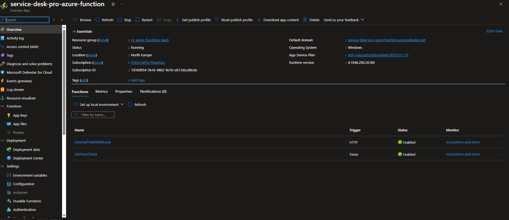
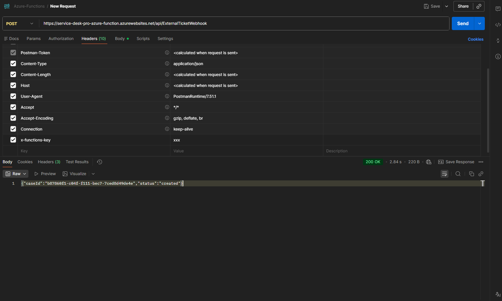
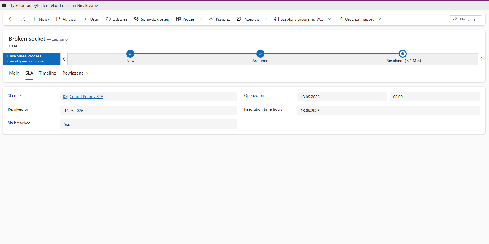
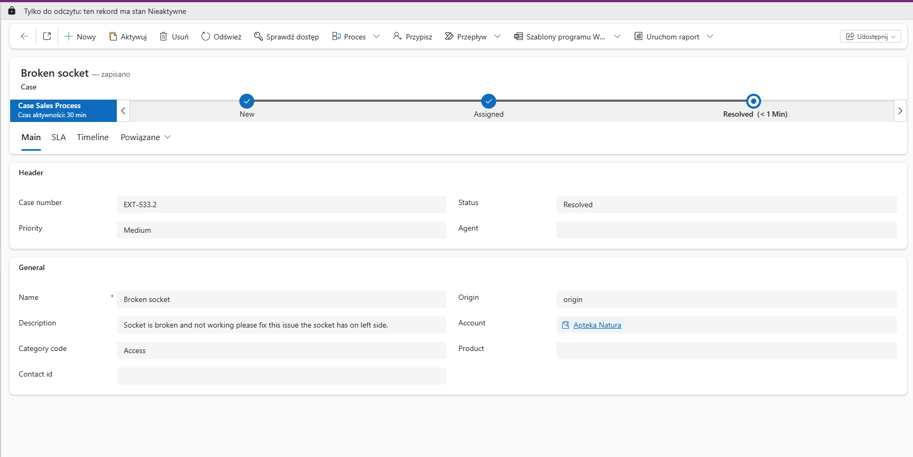

# 🗂️ ServiceDeskPro — Automation

This part of the project contains two small background programs that keep the help desk running automatically — no one needs to press a button.

---

## What these two automations do

### 1. ⏰ SLA deadline watchdog

Every **30 minutes**, this program wakes up and checks every open support ticket. If a ticket has been waiting longer than it should (based on the agreed response time), it gets flagged as **"breached"** — meaning the deadline was missed.

This helps managers spot problem tickets at a glance without manually checking each one.

---

### 2. 📨 External ticket receiver

When a ticket comes in from an outside system (like a customer portal or a third-party tool), this program **receives it automatically**, reads the details, and creates a proper case in the internal system — with the right priority level already set.

No copy-pasting, no manual entry.

---

## How it works, step by step

**Deadline watchdog:**
`Timer fires every 30 min` → `Fetch all open tickets` → `Check each deadline` → `Flag overdue ones`

**External ticket receiver:**
`Outside system sends ticket` → `Program reads the data` → `Maps priority level` → `Creates case internally`

---

## Priority mapping

When a ticket arrives from outside, its urgency label is translated to our internal scale:

| External label | Internal priority |
| -------------- | ----------------- |
| Urgent         | Critical          |
| High           | High              |
| Medium         | Medium            |
| Anything else  | Low               |

---

> 💡 Both automations run in the background entirely on their own. Once deployed, they require no human action — they just keep the help desk tidy and up to date around the clock.

